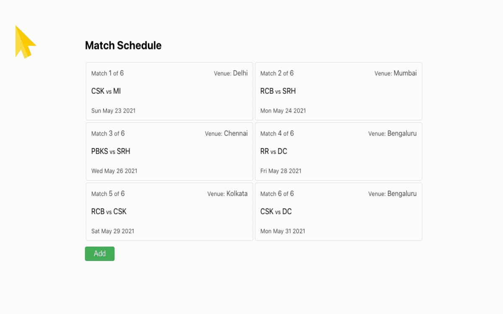
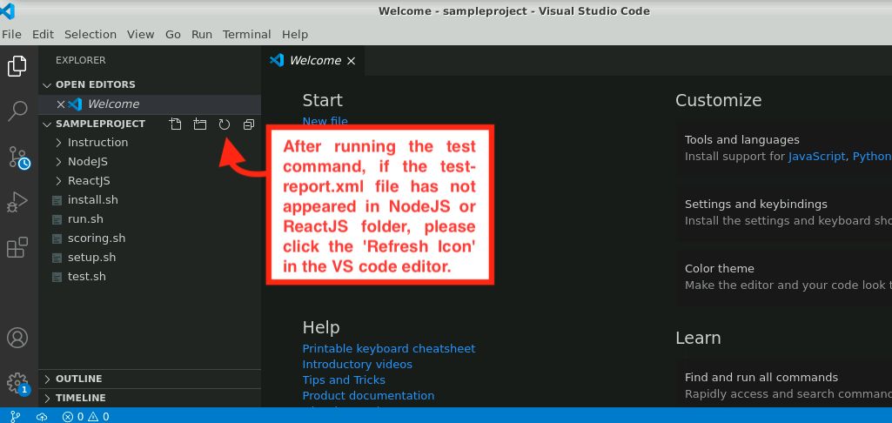

<html>

<body>
	<h2 class="title">MERN Stack App</h2>
	

	

	

		
Match Schedules  
			Develop this application using <b>ReactJS</b> and <b>NodeJS</b>. Refer to the Problem Statement and GIF
			image for details:
		

		

			
		

	

	<h2 class="note">Note:</h2>
	

	

	<ul>
		<li>To run the Full Stack application, execute the <i class="commands"><strong>sh run.sh</strong></i> command,
			from the <b>wings-reactnode-matchschedules1</b> directory.</li>
		<li>To test the Full Stack application, execute the <i class="commands"><strong>sh test.sh</strong></i> command
			from the <b>wings-reactnode-matchschedules1</b> directory.</li>
		<li>After running the test command, if the test-report.xml file has not appeared either in the NodeJS or ReactJS
			folder, click the <strong>'Refresh Icon'</strong> in the VS code editor.</li>
		
		<li>Use <strong>Fetch API</strong> for service integration calls.</li>
	</ul>

	<!--Front-end-->
	<h2 class="title">FRONT-END: ReactJS</h2>
	

	

	<ul>
		<li>This application uses ReactJS as the front-end. You have to fix the test case errors in the application. The
			test cases are written in <b>Jest</b>.</li>
		<li>The code for the front-end part is available in <b><code>ReactJS/src/</code></b> and the components are
			available in <b><code>ReactJS/src/components</code></b>.</li>
		<li>Find the other useful instructions in respective components.</li>
	</ul>

	<h3>App Component:</h3>
	<ul>
		<li>Resides in ReactJS/src/App.js</li>
		<li>Is the higher order component.</li>
		<li>Contains all the functions and the state values required for the child components.</li>
		<li>On mounting, the required data should be fetched from the back-end.</li>
		<li>Error, List, Button, Modal, and Form will be the child components.</li>
		<li><b>showModalHandler</b> and <b>closeModalHandler</b> are the functions that enable to show and close the
			modal.</li>
		<li><b>inputChangeHandler</b> is the function that handles an onChange event.</li>
		<li><b>fetchData</b> is the function that fetches data from the back-end.</li>
		<li><b>submitHandler</b> is the function that posts data to the back-end.</li>
	</ul>

	<h3>Button Component:</h3>
	<ul>
		<li>Resides in ReactJS/src/components/Button.js</li>
		<li>Is the custom button component used to Add, Save, or Close a button.</li>
	</ul>

	<h3>Error Component:</h3>
	<ul>
		<li>Resides in ReactJS/src/components/Error.js</li>
		<li>Is the component that renders error messages, if any.</li>
		<li>The prop to be passed is <b>message</b>.</li>
	</ul>

	<h3>Form Component:</h3>
	<ul>
		<li>Resides in ReactJS/src/components/Form.js</li>
		<li>Contains the title in the h3 tag.</li>
		<li>Contains the Error component to display error messages.</li>
		<li>Contains the labels and input fields.</li>
		<li>On clicking the Save button, the information filled in the form should be saved in the back-end and the
			modal should be closed.</li>
		<li>The props to be passed from the parent component are <b>error</b>,
			<b>inputOnChangeHandler</b> and
			<b>onSaveHandler</b>.</li>
	</ul>

	<h3>Modal Component:</h3>
	<ul>
		<li>Resides in ReactJS/src/components/Modal.js</li>
		<li>Contains the custom Button component to close the modal.</li>
		<li>The props to be passed from the parent component are <b>show</b>, <b>children</b> and <b>closeHandler</b>.
		</li>
	</ul>

	<h3>List Component:</h3>
	<ul>
		<li>Resides in ReactJS/src/components/List.js</li>
		<li>Use the Card component and render the match fixtures.</li>
		<li>The prop to be passed from the parent component is <b>data</b>.</li>
	</ul>

	<h3>Card Component:</h3>
	<ul>
		<li>Resides in ReactJS/src/components/Card.js</li>
		<li>Display the fixtures data.</li>
		<li>The props to be passed from the parent component are <b>_id</b>, <b>index</b>, <b>count</b>, <b>venue</b>,
			<b>team1</b>, <b>team2</b> and <b>date</b>.</li>
	</ul>

	<!--Back-end-->
	<h2 class="title">BACK-END: NodeJS</h2>
	

	

	<ul>
		<li>For the back-end, you have to use <strong>NodeJS</strong> and <strong>MongoDB</strong>.</li>
		<li>The sample and default data values are in <code>NodeJS/src/db/defaultDB.js</code>.
		</li>
		<li><strong>fixtures-db </strong> is the name of the database you will be using.</li>
		<li>There is a single collection <strong>fixtures</strong> in the database
			fixtures-db.</li>
	</ul>

	<h3><strong>Models:</strong></h3>
	
The model file is in <code>NodeJS/src/models/fixture.js</code>, and contains the following fields:

	<ul>
		<li>team1 - Date</li>
		<li>team2 - String</li>
		<li>venue - String</li>
		<li>date - Date</li>
	</ul>

	<h3><strong>Routers:</strong></h3>

	
There are two routes in <code>NodeJS/src/routers/index.js</code> :

	
<strong>1. GET <code>/fixtures</code></strong> - Lists the fixtures based on the condition passed, and returns
		all the data if there is no condition passed in query parameter.

	The condition params that can be passed are :<ul>
		<li>start_date - Matches scheduled from the start date (inclusive).</li>
		<li>end_date - Matches scheduled before the end date (inclusive).</li>
		<li>venue - Matches scheduled at the venue.</li>
	</ul>
	
These conditions can be passed individually, in combinations, or all the three together. The response is returned
		based on the condition passed.

	Sample Request:
	<strong>GET /fixtures</strong> and accepted params <strong>start_date</strong>,
	<strong>end_date</strong> and <strong>venue</strong>

	
Sample Response:

	<pre><code class="lang-json">
	{
          count: 3,
          records: [
              {
                  _id: '7d0fvj3fkv4jexcek8484fj3b',
                  team1: "CSK",
                  team2: "SRH",
                  venue: "Bengaluru",
                  date: "2021-05-31",
              },
              {
                  _id: '608f981e490bbc572108eca2',
                  team1: "KKR",
                  team2: "DC",
                  venue: "Mumbai",
                  date: "2021-06-01",
              },
              {
                  _id: '87398j5b890bbc5721dcjej3b',
                  team1: "MI",
                  team2: "PBKS",
                  venue: "Bengaluru",
                  date: "2021-06-02",
              },
          ]
      }

</code></pre>

	 
	
<strong>2. POST <code>/fixtures</code></strong> - Takes the inputs from body parameters and inserts it into
		fixture table and returns the inserted object.

	

	Sample Request:
	<strong>POST /fixtures</strong>
	<pre><code class="lang-json">      body: {
	team1: "RR",
	team2: "DC",
	venue: "Bengaluru",
	date: "2021-05-28",
      }
</code></pre>

	Sample Response:
	<pre><code class="lang-json">  {
      _id: '08f981evciebv572108udcb2',
      team1: "RR",
      team2: "DC",
      venue: "Bengaluru",
      date: "2021-05-28",
  }
</code></pre>

	<!--Database-->
	<h2 class="title"> MongoDB Commands</h2>
	

	<ul>
		<li>To open the Mongo shell, run <i class="commands"><strong>mongo </strong></i>from the terminal.
		</li>
		<li>To view the databases in MongoDB, run <i class="commands"><strong>show
					dbs</strong></i> from the mongo shell.</li>
		<li>To select a database, run <i class="commands"><strong>use fixtures-db.
				</strong></i>.</li>
		<li>To view the names of collections, run <i class="commands"><strong>show
					collections</strong></i>.
		</li>
		<li>To view the data in a collection, run <i class="commands"><strong>db.collection_name.find().</strong></i>
		</li>
		<li>To exit, press <i class="commands"><strong>ctrl+c</strong></i></li>
	</ul>

</body>

</html>